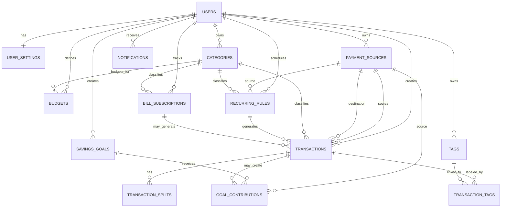

# Data Model

## Product data strategy

The app should use a simple but robust finance model:

`users + settings + payment_sources + categories + transactions + budgets + recurring_rules + savings_goals + bills_subscriptions + notifications`

This keeps the app realistic for a personal finance tracker without turning it into a full accounting system.

## Storage strategy

All primary user data should be stored locally on the device for the MVP.

Recommended implementation:

- SQLite as the database engine
- Drift as the Flutter data layer

Why this fits the model:

- the schema is relational
- reports need joins and aggregations
- budgets depend on date-range queries
- transfers and split transactions are easier to validate in SQL

Cloud sync is intentionally out of scope for the first version and should not be required to use the app.

## Core domain decision

The UI can show **Accounts**, but the backend should store them as **payment_sources / wallets**.

That gives enough flexibility for:

- cash
- bank accounts
- digital wallets
- savings accounts
- investment sources

## Feature coverage

The current model already covers the main features requested in the prompt:

- category-based analysis by month or custom range, derived from transactions
- budgets by category with warning thresholds and alerts
- accounts such as cash, cards, savings, and wallets
- transfers between accounts
- income and expense category types
- custom categories with icon and color
- category archive / soft delete
- recurring transactions
- bills and subscriptions
- savings goals
- notifications and reminders
- notes, tags, and split transactions
- export and reporting from local data

Charts and filters are UI/reporting views on top of the same transaction data; they are not stored as separate core entities.

## ERD

## Tables

### users

Main owner of the data.

- `id`
- `email` nullable
- `password_hash` nullable
- `is_guest`
- `created_at`
- `updated_at`

### user_settings

General preferences.

- `id`
- `user_id`
- `currency_code`
- `theme`
- `language`
- `start_of_month_day`
- `budget_mode`
- `balance_tracking_enabled`
- `created_at`
- `updated_at`

### payment_sources

Stores cash, bank, wallet, savings, and investment sources.

- `id`
- `user_id`
- `name`
- `type`
- `currency_code`
- `opening_balance`
- `current_balance` optional cached value
- `track_balance`
- `include_in_total_balance`
- `is_active`
- `display_order`
- `created_at`
- `updated_at`

### categories

Income and expense categories.

- `id`
- `user_id`
- `name`
- `type`
- `icon`
- `color`
- `is_system`
- `is_archived`
- `deleted_at` nullable
- `parent_category_id` nullable
- `created_at`
- `updated_at`

Rule:

- archived or soft-deleted categories should remain reference-safe for historical transactions.

### transactions

Main financial record.

- `id`
- `user_id`
- `type` (`expense`, `income`, `transfer`)
- `payment_source_id` nullable
- `destination_source_id` nullable
- `category_id` nullable
- `amount`
- `currency_code`
- `occurred_at`
- `note`
- `status` (`posted`, `pending`, `void`)
- `is_split`
- `recurring_rule_id` nullable
- `bill_subscription_id` nullable
- `created_from`
- `created_at`
- `updated_at`
- `deleted_at` nullable

### transaction_splits

Used when one transaction needs multiple categories.

- `id`
- `transaction_id`
- `category_id`
- `amount`
- `note` nullable

Rule:

- split amounts must equal the parent transaction total.

### tags

User-defined labels.

- `id`
- `user_id`
- `name`
- `color` nullable

### transaction_tags

Many-to-many relation between transactions and tags.

- `transaction_id`
- `tag_id`

### budgets

Category budgets by period.

- `id`
- `user_id`
- `category_id`
- `amount`
- `period_type`
- `start_date`
- `end_date`
- `alert_threshold_percent`
- `created_at`
- `updated_at`

MVP recommendation:

- monthly budgets first

### recurring_rules

Recurring income or expense rules.

- `id`
- `user_id`
- `type`
- `payment_source_id`
- `category_id`
- `amount`
- `note`
- `frequency`
- `interval_count`
- `start_date`
- `end_date` nullable
- `next_run_at`
- `is_active`
- `auto_post`
- `created_at`
- `updated_at`

### savings_goals

Savings targets.

- `id`
- `user_id`
- `name`
- `target_amount`
- `current_amount` optional cached value
- `target_date` nullable
- `linked_source_id` nullable
- `color` nullable
- `icon` nullable
- `is_completed`
- `created_at`
- `updated_at`

### goal_contributions

Goal deposit history.

- `id`
- `goal_id`
- `transaction_id` nullable
- `payment_source_id`
- `amount`
- `contributed_at`
- `note` nullable

### bill_subscriptions

Bills and subscriptions tracker.

- `id`
- `user_id`
- `name`
- `category_id`
- `default_payment_source_id` nullable
- `amount`
- `frequency`
- `due_day` nullable
- `next_due_date`
- `is_subscription`
- `is_active`
- `reminder_days_before`
- `created_at`
- `updated_at`

### notifications

Alerts and reminders.

- `id`
- `user_id`
- `type`
- `title`
- `body`
- `related_entity_type`
- `related_entity_id`
- `scheduled_at`
- `read_at` nullable
- `created_at`

## Business rules

### Expense

- decreases the selected source balance
- belongs to an expense category
- can support split categories

### Income

- increases the selected source balance
- belongs to an income category

### Transfer

- moves balance between two sources
- does not count as an expense
- should not pollute expense analytics

### Edit transaction

- apply delta logic instead of blindly recalculating
- if the source changes, revert the old effect and apply the new one
- wrap the full update in a database transaction

### Delete transaction

- prefer soft delete with `deleted_at`
- revert the source balance impact
- recalculate budget usage for the affected period

### Budgets

- budget usage should be derived from posted transactions in range
- include split transactions
- exclude transfers
- exclude deleted or void items

### Recurring rules

- a background job can scan `next_run_at`
- create the generated transaction
- advance the next run date

## Reporting rules

- income vs expense charts should exclude transfers
- cash flow = income - expenses
- account balances should reflect the source history and any cached balance logic
- category charts should include split transactions by split line, not only the parent category

## MVP boundary

Do not introduce double-entry accounting in the first version. The app should remain simple enough for daily personal finance use.
