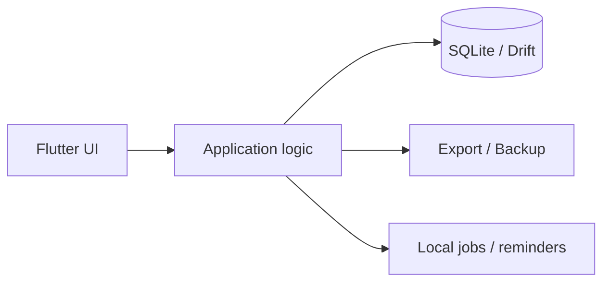

# Local Storage Strategy

## Decision

Finance will run all user data locally on the device for the MVP.

That means:

- transactions stay on the phone
- categories stay on the phone
- budgets stay on the phone
- accounts/payment sources stay on the phone
- recurring rules, goals, bills, and notifications stay on the phone

The app will not depend on a remote backend to be useful.

## Selected database

**Selected stack: SQLite with Drift.**

Why this is the chosen stack for this app:

- the data is relational
- budgets and reports need strong filtering and aggregation
- transfers, splits, and recurrence are easier to model with SQL
- it is mature, proven, and efficient on phones
- it supports migrations and schema control well

## Why not a document-only store

Object databases such as Isar or Realm can work, but SQLite is a better fit here because:

- the app needs joins across transactions, categories, tags, and accounts
- report queries are easier to express in SQL
- budget calculations are naturally relational
- the data model already looks like normalized finance data

## Storage principles

- Local-first by default
- Offline usable at all times
- Fast transaction entry and search
- Deterministic reporting from local records
- Optional backup/export later, not required for core use

## Data ownership

All primary records remain on-device:

- user profile and settings
- payment sources
- categories
- transactions and split lines
- tags
- budgets
- recurring rules
- savings goals
- bills and subscriptions
- notifications

## Sync and cloud

Cloud sync is out of scope for the MVP.

If added later, it should be treated as an optional layer on top of the local database rather than the source of truth.

## Backup, export, and restore

- Export must package all app data into a ZIP file that can be shared.
- Import must accept the exported ZIP and restore the full local state correctly.
- Reset local data is a separate destructive action that deletes all local data and reinitializes defaults.
- Export/import should include the full SQLite data plus any metadata needed to restore settings, accounts, categories, budgets, goals, recurring rules, bills, and notifications.

## Performance notes

For phone performance, the storage layer should support:

- indexed queries for date ranges, categories, and payment sources
- pagination for long transaction lists
- cached balance fields where appropriate
- background updates for recurring entries and reminders

## Security note

If the app later handles sensitive backup or sync flows, consider database encryption or protected storage at that stage.

## Architecture summary

