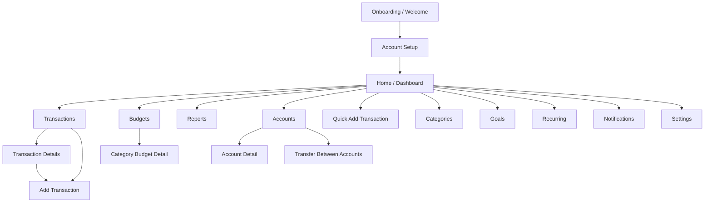

# Product Overview

## App summary

**Finance** is a mobile personal finance app for iOS and Android that helps users track income and expenses, manage budgets, organize transactions, and understand cash flow quickly.

The product is designed for fast daily use. The core experience must make it easy to add a transaction in a few taps, while still supporting advanced finance features like recurring items, transfers, goals, bills, analytics, and exports.

## Primary users

- Students
- Freelancers
- Employees
- Couples
- Young professionals

## Product principles

- Fast daily use
- Extremely easy transaction entry
- Clear separation between income and expenses
- High readability
- Strong visual organization by category and section
- Trustworthy fintech aesthetic
- Realistic production-ready mobile UI

## Navigation model

The app uses a bottom navigation bar with 5 tabs:

1. Home
2. Transactions
3. Budgets
4. Reports
5. Accounts

Secondary screens are accessed through profile, more actions, bottom sheets, or contextual shortcuts:

- Categories
- Goals
- Recurring
- Notifications
- Settings
- Profile / Preferences

## Product scope decision

The backend should not model the app as heavy accounting from day 1. The best fit for the requested product is:

`transactions + categories + payment_sources/wallets + budgets`

That approach matches the real-world use cases described in the prompt:

- Cash
- BBVA
- Nu
- Mercado Pago
- GBM

Those are treated as payment sources in the data model, even if the UI labels them as accounts.

## Navigation diagram

## Product boundaries

In MVP, keep the app focused on:

- manual transaction entry
- account/source tracking
- category budgets
- reports and insights
- recurring reminders

Defer more complex finance features until later:

- double-entry accounting
- bank sync
- loans and debt amortization
- investment performance tracking
- OCR receipt scanning
- shared household rules

